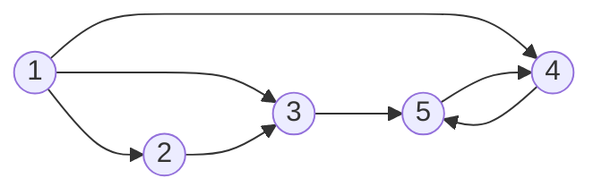

# Minimaler Kostenfluss
Wir betrachten ein Netzwerk bestehend aus fünf Knoten und einer Menge Kanten. Es gibt zwei Bezugsknoten (1 und 2) und zwei Nachfrageknoten (4 und 5). Knoten 3 ist ein Umladeknoten

(Aktuell wird die Darstellung von mermaid graphs noch nicht von GitHub unterstützt (https://github.com/github/markup/issues/533). Mit VS Code werden die Grafiken angezeigt.)

In der Datei input.xlsx sind die folgenden Informationen gegeben:
* Kosten pro Einheit bei Fluss durch die Kante,
* maximale Kapazität für den Fluss durch die Kante,
* Nettodurchsatz an den Knoten.

Ziel ist die Minimierung der Gesamtkosten zur Sendung der verfügbaren Daten durch das Netzwerk zu den Nachfrageknoten.