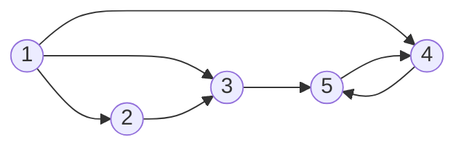

# Minimum cost flow problem
We consider a network consists of five nodes and a set of arcs. There are two supply nodes (1 and 2) and two demand nodes (4 and 5). Note 3 is a transshipment node. 

(Unfortunately GitHub do not support the visualization of mermaid graphs not yet (https://github.com/github/markup/issues/533). But you can view on VS Code.)

In the input file are the given informations
* costs per unit flow through the arcs,
* maximal capacities for the arcs,
* net flow generated at the nodes.

The aim is to minimize the total costs of sending the available supply through the network to satisfy the demand. 